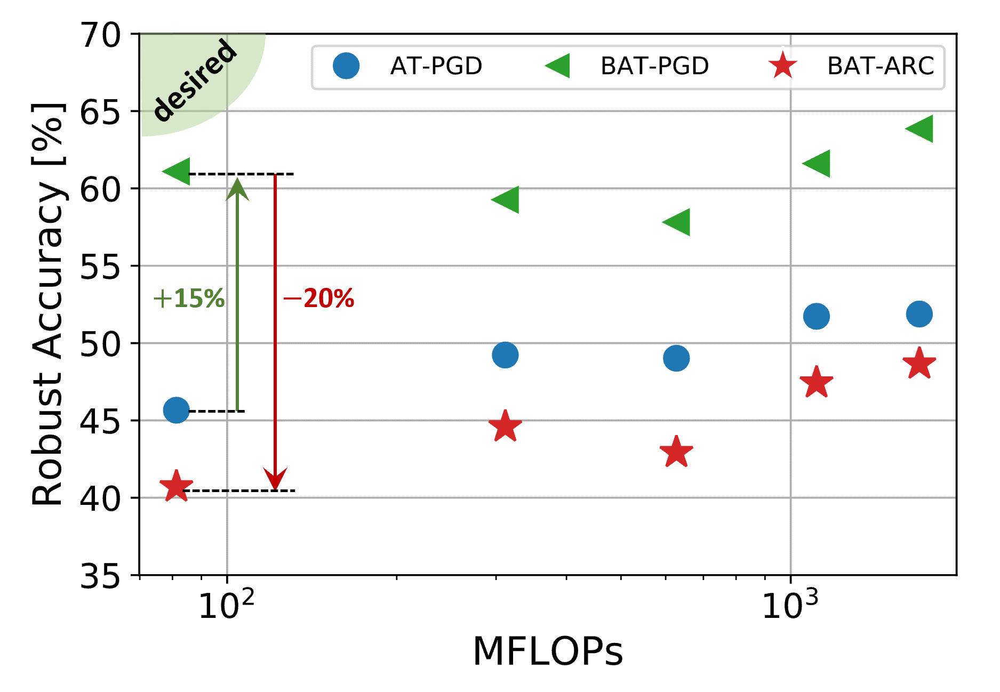
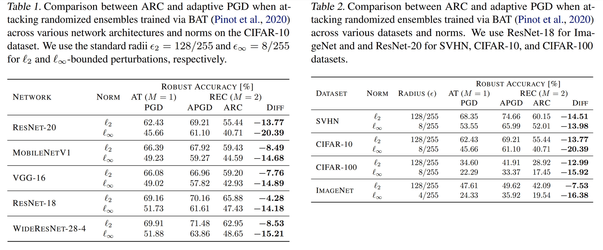

# Adversarial Vulnerability of Randomized Ensembles

This repository contains the code and pre-trained models for our paper [Adversarial Vulnerability of Randomized Ensembles](TODO) by Hassan Dbouk and [Naresh R. Shanbhag](http://shanbhag.ece.illinois.edu/) (ICML 2022).


## Summary

Despite the tremendous success of deep neural networks across various tasks, their vulnerability to imperceptible adversarial perturbations has hindered their deployment in the real world. Recent works on randomized ensembles, e.g., [Boosted Adversarial Training (BAT)](https://arxiv.org/abs/2002.11565) by Pinot et al., 2020, have empirically demonstrated significant improvements in adversarial robustness over standard adversarially trained (AT) models with minimal computational overhead, making them a promising solution for safety-critical resource-constrained applications. However, this impressive performance raises the question: _Are these robustness gains provided by randomized ensembles real?_ In this work we address this question both **theoretically** and **empirically**. We first establish theoretically that commonly employed robustness evaluation methods such as adaptive PGD (APGD) provide a _false_ sense of security in this setting. Subsequently, we propose a theoretically-sound and efficient adversarial attack algorithm (ARC) capable of compromising random ensembles even in cases where adaptive PGD fails to do so. We conduct comprehensive experiments across a variety of network architectures, training schemes, datasets, and norms to support our claims, and empirically establish that randomized ensembles are in fact _more vulnerable_ to $\ell_p$-bounded adversarial perturbations than even standard AT models.

<p align="center">

</p>
<p align = "center">
Figure 1. The adversarial vulnerability of randomized ensembles across various network architectures (from left to right: ResNet-20, MobileNetV1, VGG-16, ResNet-18, and WideResNet-28-4) against $\ell_\infty$ norm-bounded perturbations on CIFAR-10. Compared to a standard adversarially trained (AT) single model ($\bullet$), a randomized ensemble of two models obtained via BAT ($\blacktriangleleft$) offers significant improvement in robustness at iso-FLOPs, when evaluated using an adaptive PGD adversary. However, the robust accuracy of the BAT ensemble suffers a massive drop and becomes worse than even the single model AT baseline when evaluated using the proposed ARC ($\star$) adversary, rendering the ensemble obsolete.
</p>


## Contributions

We make the following contributions:
* We prove that standard attack algorithms such as PGD suffer from a fundamental flaw when employed to attack randomized ensembles of linear classifiers -- there are no guarantees that it will find norm-bounded adversarial perturbation even when one exists (_inconsistency_).
* We propose a provably (for linear classifiers) _consistent_ and efficient adversarial perturbation algorithm -- the <ins>A</ins>ttacking <ins>R</ins>andomized ensembles of <ins>C</ins>lassifiers (ARC) algorithm -- that is tailored to evaluate the robustness of randomized ensembles against norm-bounded perturbations.
* We employ the ARC algorithm to demonstrate empirically that randomized ensembles of DNNs are in fact _more_ vulnerable to norm-bounded perturbations than standard AT DNNs (see Fig.1). 
* We conduct comprehensive experiments across a variety of network architectures, training schemes, datasets, and norms to support our observations.

<p align="center">

</p>
<p align = "center">

</p>


## What is in this Repo?
We provide a PyTorch implementation of our ARC algorithm from our [paper](TODO). The code provided can be used to evaluate the robustness of randomized ensembles using both adaptive PGD (APGD) which uses the expected loss function, and our proposed ARC algorithm. Specifically, `eval_robustness_bat_sweep.py` can be used to evaluate the robustness of [BAT](https://arxiv.org/abs/2002.11565) RECs while sweeping parameters such as sampling probability $\alpha$, number of attack steps $K$, attack strength $\epsilon$, etc. We also provide `eval_robustness_dverge_sweep.py` for evaluating the robustness of RECs consutrcuted from [DVERGE](https://github.com/zjysteven/DVERGE) models. You can download some of our pre-trained [BAT](https://arxiv.org/abs/2002.11565) models from [here](TODO).


## Examples
This code was run with the following dependencies, make sure you have the appropriate versions downloaded and installed properly.
 ```
python 3.6.9
PyTorch 1.7.0
numpy 1.19.2
torchvision 0.8.0
```
1.  clone the repo: `git clone https://github.com/hsndbk4/ARC.git`
2.  make sure the appropriate dataset folders are setup properly (check `get_dataloaders` in `datasets.py`)
3.  download two pre-trained BAT ResNet-20s on CIFAR-10 from [here](TODO)
4.  place both models in an appropriate folder in the root directory, e.g. `outdir_cifar10/resnet20_bat_linf`

We are now set to run some scripts. To re-produce the ResNet-20 $\ell_\infty$ numbers in Table 1, you can run the following commands:

```
# for APGD:
CUDA_VISIBLE_DEVICES=0,1 python eval_robustness_bat_sweep.py --model resnet20 --fname "outdir_cifar10/resnet20_bat_linf/model_1" "outdir_cifar10/resnet20_bat_linf/model_2" --norm l_inf --dataset cifar10 --epsilon 8 --outdir "outdir_cifar10/resnet20_bat_linf/" --attack pgd  --alpha 0.9 --eta 2 --attack-iters 20

# for ARC:
CUDA_VISIBLE_DEVICES=0,1 python eval_robustness_bat_sweep.py --model resnet20 --fname "outdir_cifar10/resnet20_bat_linf/model_1" "outdir_cifar10/resnet20_bat_linf/model_2" --norm l_inf --dataset cifar10 --epsilon 8 --outdir "outdir_cifar10/resnet20_bat_linf/" --attack arc  --alpha 0.9 --eta 8 --attack-iters 20
```
To re-produce the data of our plot in Fig. 2(a), you can run the following script in a bash shell:
```
for alpha in $(seq 1 -0.05 0.5)
do
    echo $alpha
    CUDA_VISIBLE_DEVICES=0,1 python eval_robustness_bat_sweep.py --model resnet20 --fname "outdir_cifar10/resnet20_bat_linf/model_1" "outdir_cifar10/resnet20_bat_linf/model_2" --norm l_inf --dataset cifar10 --epsilon 8 --outdir "outdir_cifar10/resnet20_bat_linf/" --attack pgd  --alpha $alpha --eta 2 --attack-iters 20
    CUDA_VISIBLE_DEVICES=0,1 python eval_robustness_bat_sweep.py --model resnet20 --fname "outdir_cifar10/resnet20_bat_linf/model_1" "outdir_cifar10/resnet20_bat_linf/model_2" --norm l_inf --dataset cifar10 --epsilon 8 --outdir "outdir_cifar10/resnet20_bat_linf/" --attack arc  --alpha $alpha --eta 8 --attack-iters 20
done
```


To re-produce the CIFAR-100 $\ell_2$ numbers in Table 2, download the appropriate pre-trained models and run the following commands:
```
# for APGD:
CUDA_VISIBLE_DEVICES=0 python eval_robustness_bat_sweep.py --model resnet20 --fname "outdir_cifar100/resnet20_bat_l_2/model_1" "outdir_cifar100/resnet20_bat_l_2/model_2" --norm l_2 --dataset cifar100 --epsilon 128 --outdir "outdir_cifar100/resnet20_bat_l_2/" --attack pgd  --alpha 0.9 --eta 32 --attack-iters 20

# for ARC:
CUDA_VISIBLE_DEVICES=0 python eval_robustness_bat_sweep.py --model resnet20 --fname "outdir_cifar100/resnet20_bat_l_2/model_1" "outdir_cifar100/resnet20_bat_l_2/model_2" --norm l_2 --dataset cifar100 --epsilon 128 --outdir "outdir_cifar100/resnet20_bat_l_2/" --attack arc  --alpha 0.9 --eta 32 --attack-iters 20 --g 4
```

To re-produce the data of our plot in Fig. 4(b), you can download the $\ell_\infty$ DVERGE models from their public [repo](https://github.com/zjysteven/DVERGE) and run the following script in a bash shell:
```
array=( 1 2 3 4 5 6 7 8 16)
for epsilon in "${array[@]}"
do
     echo $epsilon
     CUDA_VISIBLE_DEVICES=0 python eval_robustness_dverge_sweep.py --outdir "outdir_cifar10/resnet20_dverge" --attack pgd --attack-iters 20 --epsilon $epsilon --eta 2 --sweep-param 'epsilon' --norm l_inf --dataset cifar10
     CUDA_VISIBLE_DEVICES=0 python eval_robustness_dverge_sweep.py --outdir 'outdir_cifar10/resnet20_dverge' --attack arc --attack-iters 20 --epsilon $epsilon --eta $epsilon --sweep-param 'epsilon' --norm l_inf --dataset cifar10
done
```


## Citation

If you find our work helpful, please consider citing it.
```
@inproceedings{dbouk2022adversarial,
  title={Adversarial Vulnerability of Randomized Ensembles},
  author={Dbouk, Hassan and Shanbhag, Naresh R.},
  booktitle={International Conference on Machine Learning},
  year={2022},
  organization={PMLR}
}

```

## Acknowledgements

This work was supported by the Center for Brain-Inspired Computing (C-BRIC) and the Artificial Intelligence Hardware (AIHW) program funded by the Semiconductor Research Corporation (SRC) and the Defense Advanced Research Projects Agency (DARPA).

Parts of the code in this repository are based on following awesome public repositories:

* [https://github.com/locuslab/robust_overfitting](https://github.com/locuslab/robust_overfitting)
* [https://github.com/zjysteven/DVERGE](https://github.com/zjysteven/DVERGE)
